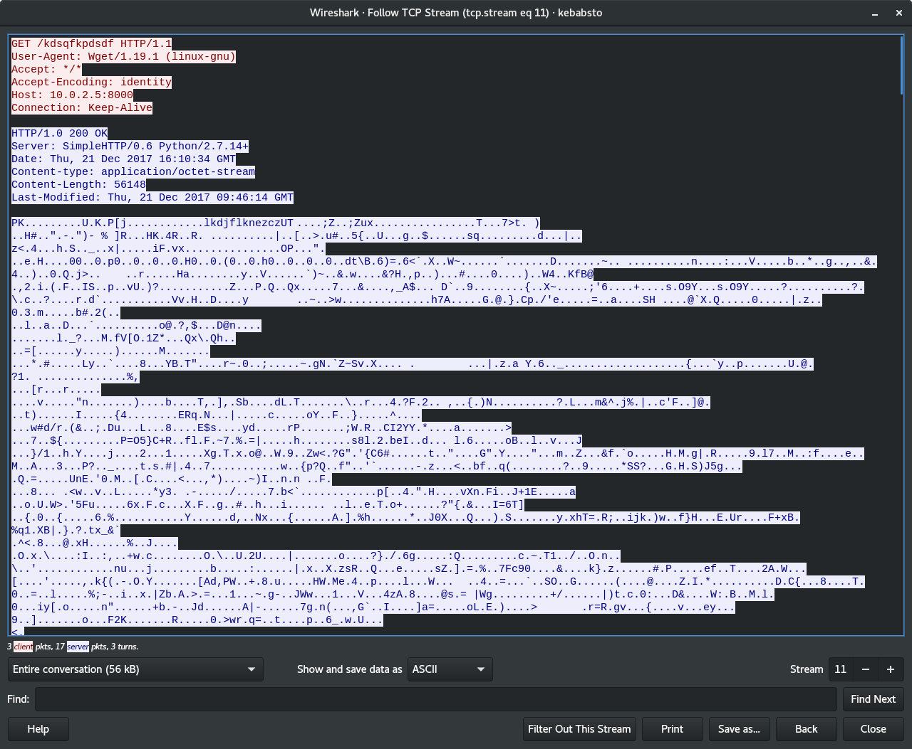
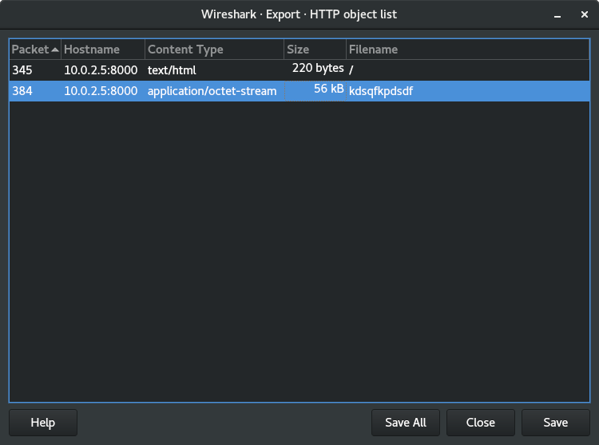
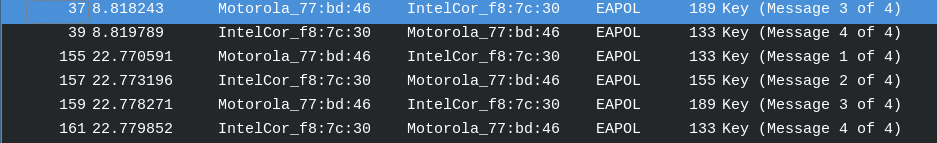
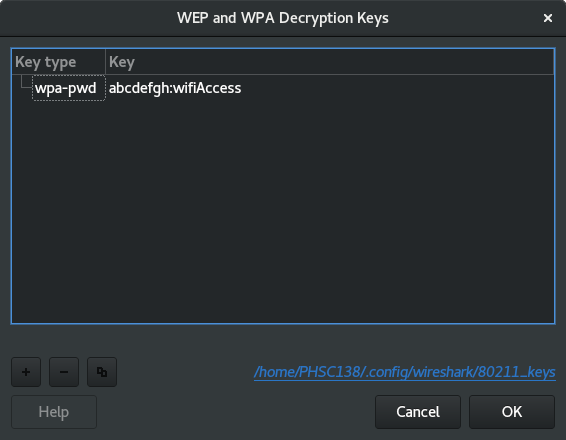
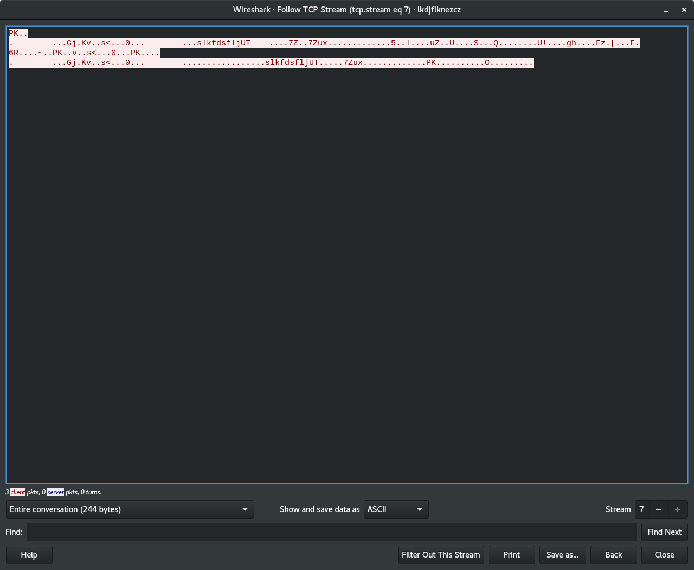

# KEBAB STO
We start with kebabsto.pcapng, so our first step is to open it in Wireshark.

From TCP stream 5 we see two huge hints:
1) "The name of the file begins with "kd"
and
2) "they also found a service at mydomainndh.ndh (port 55555) which decrypts every text encrypted with the public key, apart from the interesting one"
## Part 1:
We'll start with #1:
In TCP stream 11 we can see that there is a file being got "GET /kdsqfkpdsdf"


Try to export HTML file: 


We save it, and it's a zip file
```
file kdsqfkpdsdf
kdsqfkpdsdf: Zip archive data, at least v2.0 to extract
```

When we unzip it, it's another capture file

```
file lkdjflknezcz
lkdjflknezcz: tcpdump capture file (little-endian) - version 2.4 (802.11, capture length 65535)
```

Going through this dump we see it's 802.11 so we can't actually see what the packets are...
We have a full 4 way handshake 

and the SSID: "wifiAccess" from packet 761/765... etc. 

So let's do some aircrack-ng with the rockyou password list...

```
aircrack-ng lkdjflknezcz -w ../rockyou.txt
Opening lkdjflknezcz
Read 1358 packets.

   #  BSSID              ESSID                     Encryption

   1  F0:D7:AA:77:BD:46  wifiAccess                WPA (1 handshake)

Choosing first network as target.

Opening lkdjflknezcz
Reading packets, please wait...

                                 Aircrack-ng 1.2 rc4

      [00:00:00] 612/7120714 keys tested (2478.91 k/s)

      Time left: 47 minutes, 53 seconds                          0.01%

                           KEY FOUND! [ abcdefgh ]


      Master Key     : 46 DE 68 77 59 26 52 28 68 59 E3 E9 27 C2 75 66
                       77 A0 C0 C2 59 7C B7 6A 52 06 A3 B8 5D 7F 33 29

      Transient Key  : C8 2A 89 4B 43 93 57 73 35 B7 9E 21 99 8A 5A F2
                       B6 89 B8 10 F6 AF 77 68 A8 B4 69 E7 30 E4 A7 9B
                       88 32 93 FF AA B5 8E CE 9E AC 4A 05 05 0C EC BB
                       37 C9 12 11 5B DA 0C E9 D8 25 02 5E F3 D2 AA 4F

      EAPOL HMAC     : 76 32 AE BA 65 FD A2 64 BD FD 8E 76 BA 1F B7 84
```
It found the key very quick!!
So now we go into the 802.11 protocol settings: to add the decryption key:SSID (wifiAccess) 
abcdefgh:wifiAccess



In packet 1292 there's another zip file, save as raw to "slkfdsfljkj"


Tried to unzip and it's asking for a password...
```
unzip slkfdsfljkj
Archive:  slkfdsfljkj
[slkfdsfljkj] slkfdsflj password:
```

## Part 2
Time to go to #2!
2) "they also found a service at mydomainndh.ndh (port 55555) which decrypts every text encrypted with the public key, apart from the interesting one"
We use follow TCP stream of the FIRST .pcap (kebabsto.pcapng), we see a mail conversation and a file being sent.

In stream 13 we get the file "docs.zip"
```
UEsDBAoAAAAAAFZ6lUsAAAAAAAAAAAAAAAAFABwAZG9jcy9VVAkAA8PCO1rdwjtadXgLAAEE
AAAAAAQAAAAAUEsDBBQAAAAIALd5lUvQbcUR4wAAABABAAAPABwAZG9jcy9wdWJrZXkucGVt
VVQJAAOawTtamsE7WnV4CwABBAAAAAAEAAAAAGXPvVaDMABA4Z2n6M7hlAoKjEmIIWDTRsQD
bBESaKAHqBZant6f1Tve7bOsnyAmlG2OGXyhaJPg4vdZxp4StQc2QelEUvrhhBxDwDMAXMJA
iOCJJ7DhyI9Zy6iQHS91tfO3c1HK3dO8xEZeTcr/fNflBXHlicfbpSZjdOg7hL8EVolIUG76
7EwCoO/SC1yXVlHkyb7QrT1Kaqy79PU6d+71efRANYAgdtb6EGdi3T6oocl7YS5qPca3KRig
NxdAuW+lduwwS9WY0co4iWaxdat13Y5nqbC50BBwAI0/IWbhP/Q3UEsDBBQAAAAIAFZ6lUus
24QeoQAAADUBAAAPABwAZG9jcy9jaXBoZXJUZXh0VVQJAAPDwjtaw8I7WnV4CwABBAAAAAAE
AAAAABWPyREAQQgC/xuNFwL5J7bOS6pstWWJTYxoe/3qYopgqq6OQruta0ieSC8nAmvPMGJU
dmics9wyyrkHpTRV0wVPZoYboT5GDCYmr+GHtrBhLuuGW4llFBXLTFgBbJPOEurBXQ6c0m1c
xGlI0ZF9wq0L1SeoSkY/n+jtPLcLieaBhiYBAtmsZutOmad7MwzEiXVy4+6Z991gvMPi2ewk
6/sBUEsBAh4DCgAAAAAAVnqVSwAAAAAAAAAAAAAAAAUAGAAAAAAAAAAQAO1BAAAAAGRvY3Mv
VVQFAAPDwjtadXgLAAEEAAAAAAQAAAAAUEsBAh4DFAAAAAgAt3mVS9BtxRHjAAAAEAEAAA8A
GAAAAAAAAQAAAKSBPwAAAGRvY3MvcHVia2V5LnBlbVVUBQADmsE7WnV4CwABBAAAAAAEAAAA
AFBLAQIeAxQAAAAIAFZ6lUus24QeoQAAADUBAAAPABgAAAAAAAEAAACkgWsBAABkb2NzL2Np
cGhlclRleHRVVAUAA8PCO1p1eAsAAQQAAAAABAAAAABQSwUGAAAAAAMAAwD1AAAAVQIAAAAA
```


It's base64 encdoed ("Content-Transfer-Encoding: base64") I could have also decoded it in wireshark before but this works as well..
```
base64 -d < doc > docs.zip
```

unzip docs.zip

we get cipherText and pubkey.pem

The mydomain... is just the url from the challenge page: kebabsto.challs.malice.fr
There was an error in the file, the port is actually 8888 and not 55555

inputted the cipherText and got 
```
Here is the cleartext of your input :


123360975347216093033775350245751721746535757669936
```
This is when the CTF ended...

To get the right ciphertext you had to encrypt the cipherText with the public key, convert to decimal and send it to the server (thx <pzoejkdfez> )
It spits out: 
```
Th1s1s2P@ss_W0rd%M0f0
```

After this we just unzip slkfdsfljkj with the password and get the flag:
```
The flag is : ndh2k18{M4k3M4tr10cHKa9r34T4g41n}
```
